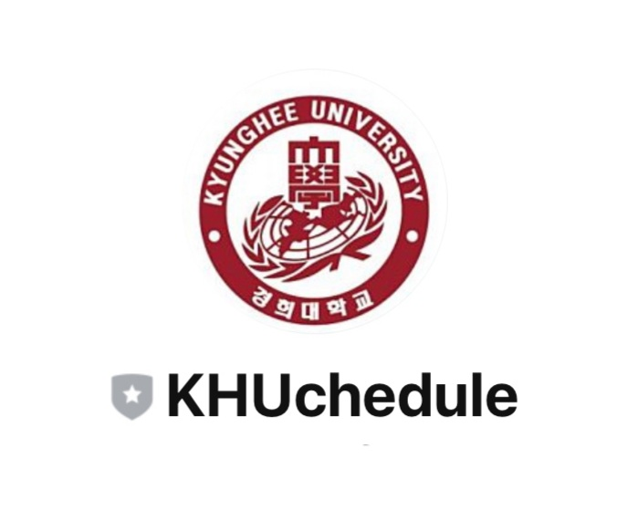
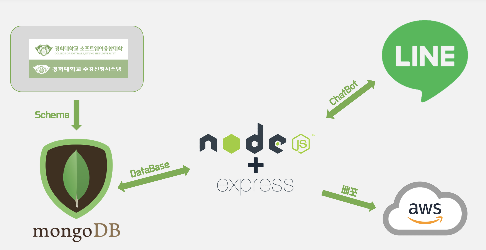
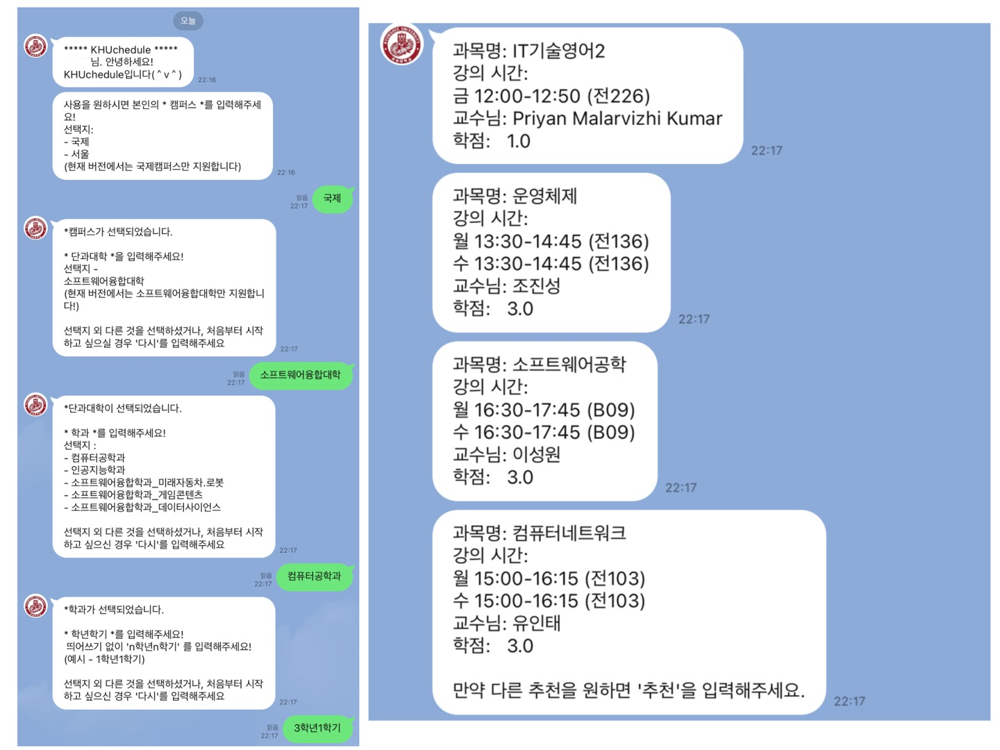
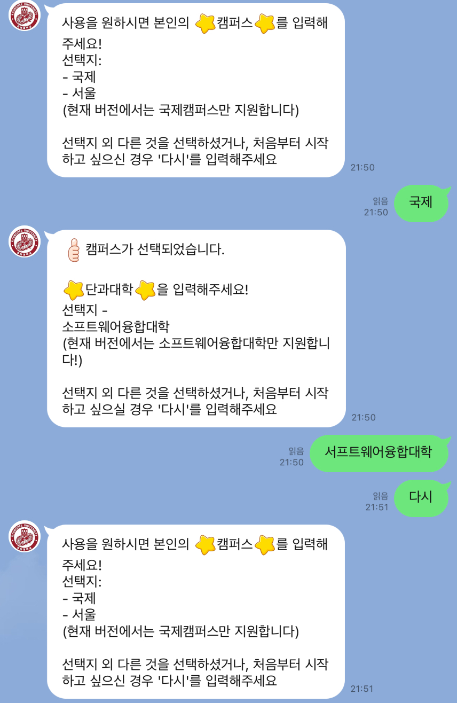

<div align="center"></div>
# About the project

+ **사용자가 본인의 캠퍼스, 단과대학, 학과, 학년학기를 순서대로 입력하면 경희대학교 학과 홈페이지의 권장이수체계도에서 제공하는 과목들의 개설시간을 고려한 시간표를 랜덤으로 제공함
마음에 들지 않는다면 시간표 재생성 가능**

## * Architecture
<div align="center"></div>
<br>

 ---
### 개발동기
+ 학기가 시작하기 전에, 많은 학생들이 경희대학교 학과 홈페이지에서 권장하는 이수체계도를 참고하지만 매번 확인이 번거롭고, 무엇보다 학기마다 전공 과목의 개설시간과 교수님 등의 정보가 바뀌어서 매 학기마다 희망과목을 담기 전에 미리 시간을 확인하고 직접 예정시간표에 추가해서 따져보아야 한다. 
이러한 문제점으로, 학과 홈페이지에서 제공하는 권장이수체계도에 따른 전공과목을 미리 넣어둔 시간표를 알 수 있다면 편리할 것 같아 이 프로젝트를 고안함
<br> <br>

 

 ---
### 기대효과
+ 챗봇이 시간표 케이스들을 제공해준다면, 사용자는 남은 시간 자리에 원하는 과목(교양, 배분이수 등)을 추가하여 수월하게 시간표 경우의 수를 계산할 수 있음
<br> <br> <br> <br>


---
# Built With
* [Node.js](https://nodejs.org/)
<br> <br> <br> <br>


# Getting Started
## How to Install
1. Clone the Repository
   ```
   git clone http://khuhub.khu.ac.kr/2019102206/time_table.git
   ```
2. npm install
   ```
   npm install
   ```
   
<br> <br> <br> <br>


# Usage
<div align="left"></div>
위 QR 이미지를 통해 LINE 챗봇 친구추가가 가능합니다!
혹은 LINE app에서 ID 찾기로 친구추가할 수 있습니다! (ID : @419rrsrp)
<br>
<br>


<div align="left"></div>
올바른 사용 과정 예시입니다. 챗봇의 안내메세지에 따라 순서대로 답변하시면 됩니다! <br>
   추천결과가 마음에 들지 않는다면, '추천'을 입력해서 다시 재생성이 가능합니다!
 <br>
 <br>


<div align="left"></div>
잘못 사용한 예제입니다. '다시'를 입력해주시면 처음부터 진행됩니다!
<br>  <br>  <br>  <br>  

---
# Roadmap
* [x] 학과별 권장이수체계도 정보 파일 생성
* [x] Data crawling
* [x] 크롤링 정보 데이터화(with node.js)
* [x] DB 작업
* [x] 권장이수체계에 맞는 시간표 랜덤 생성
* [x] Chatbot 구현(Demo)
* [ ] 확장
 - [ ] 전자정보대학


(Demo 현재 소프트웨어융합대학 소속 학과만 제공)
<br>  <br>  <br>  <br>  


---
# Contributing
* Fork the project
* Create your Feature Branch(git checkout -b feature/{function})
* Commit your Changes (git commit -m 'Add some function)
* Push to the Branch (git push origin feature/{function})
* Open a Pull Request

<br>  <br>  <br>  <br> 

  
---
# License
[MIT LICENSE](LICENSE)


<br>  <br>  <br>  <br>  

---
# Contact
* 곽병민 : bqudmals@khu.ac.kr
* 송민석 : songms0909@khu.ac.kr
* 이나경 : 2000skrud@khu.ac.kr
* Project Link : [http://khuhub.khu.ac.kr/2019102206/time_table](http://khuhub.khu.ac.kr/2019102206/time_table)
